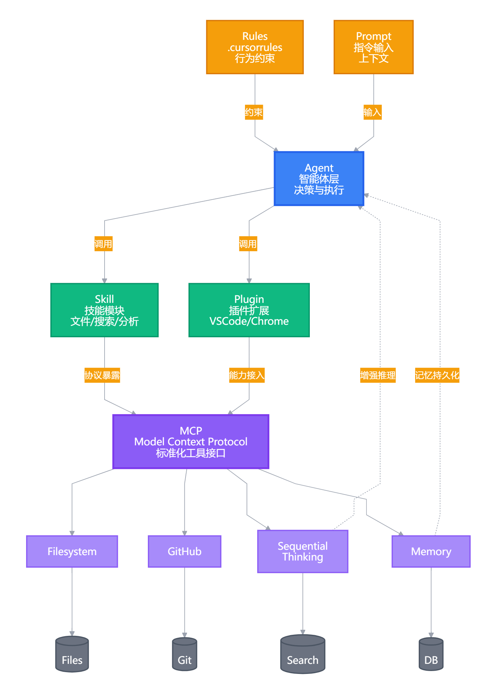

# Vibe Coding 基本概念

## 核心概念对比

| 概念     | 层级  | 核心作用          | 比喻                      |
| ------ | --- | ------------- | ----------------------- |
| Agent  | 最高层 | 自主决策、执行任务的智能体 | 像一位项目经理，能自己规划、调用工具、完成任务 |
| Skill  | 功能层 | 封装好的特定能力模块    | 像专业技能证书，会开车、会做饭、会写代码    |
| MCP    | 协议层 | 标准化的工具连接规范    | 像USB-C 接口标准，让不同设备能互相通信  |
| Plugin | 扩展层 | 为特定平台增加功能的插件  | 像浏览器扩展，给某个软件加新功能        |
| Prompt | 指令层 | 直接给 AI 的文本指令  | 像口头交代任务，"帮我写一封邮件"       |
| Rules  | 约束层 | 定义行为边界和规范的规则  | 像员工手册，规定什么能做、什么不能做      |


<div align="center">
  
</div>

## 详细解析与联系

### 1. Agent（智能体）

**定义**：能够自主感知、决策、执行的 AI 系统

**关键特征**：

- 有目标导向（能分解任务）
- 能调用工具（MCP/Skill/Plugin）
- 有记忆和状态管理
- 能循环执行直到完成

**示例**：Claude Code、AutoGPT、Devin、Cursor Composer

### 2. Skill（技能）

**定义**：封装好的、可复用的能力单元，通常有明确的输入输出

**关键特征**：

- 功能单一且明确（如"搜索网页"、"读取文件"）
- 可被 Agent 调用
- 可能有代码实现，也可能只是 Prompt 模板

**与 MCP 的关系**：Skill 可以通过 MCP 协议暴露给 Agent 使用

**示例**：

```json
// Skill 定义示例
{
  "name": "web_search",
  "description": "搜索互联网信息",
  "input": {"query": "string"},
  "output": {"results": "array"},
  "implementation": "mcp://search-server/search"  // 通过 MCP 实现
}
```

### 3. MCP（Model Context Protocol）

**定义**：Anthropic 推出的开放协议标准，用于标准化 AI 与外部工具的连接

**关键特征**：

- 协议标准（不是具体工具）
- 解决"每个工具都要单独适配"的问题
- 基于 JSON-RPC，支持 stdio/SSE 传输
- 工具、资源、Prompt 模板都可通过 MCP 暴露

**示例**：Figma MCP、Sequential Thinking MCP 都是这个层面的东西

### 4. Plugin（插件）

**定义**：为特定平台/软件增加功能的扩展组件

**关键特征**：

- 平台强相关（VSCode 插件、Chrome 插件、Obsidian 插件）
- 通常有独立的 UI 和交互
- 用户手动安装管理

**与 MCP 的区别**：

| <br /> | Plugin  | MCP              |
| :----- | ------- | ---------------- |
| 范围     | 特定软件    | 任何支持 MCP 的 AI 应用 |
| 安装     | 应用商店/手动 | 配置文件添加           |
| 交互     | 可能有 GUI | 纯后台，AI 直接调用      |
| 标准化    | 各平台不同   | 统一协议             |

**示例**：VSCode 的 GitLens 插件、Chrome 的 AdBlock 插件

### 5. Prompt（提示词）

**定义**：直接给 AI 的文本指令，最基础的交互方式

**层级关系**：

- **System Prompt**：定义 AI 角色和行为基准（如"你是一个 helpful 的助手"）
- **User Prompt**：用户的具体请求
- **Few-shot Prompt**：给示例让 AI 模仿
- **Chain-of-thought Prompt**：引导 AI 逐步思考

**与 Rules 的关系**：Rules 通常以 System Prompt 的形式存在

### 6. Rules（规则）

**定义**：约束 AI 行为的规范集合，定义边界和最佳实践

**常见形式**：

- .cursorrules 文件（Cursor）
- claude.md（Claude Code）
- system\_prompt 中的约束部分

**内容示例**：

```markdown
# 编码规则
- 必须使用 TypeScript 严格模式
- 所有函数必须有 JSDoc 注释
- 禁止直接操作 DOM，必须使用 React 的方式
- 每次修改后必须运行测试

# 沟通规则  
- 用中文回复
- 代码块必须指定语言
- 不确定时先询问而非假设
```

