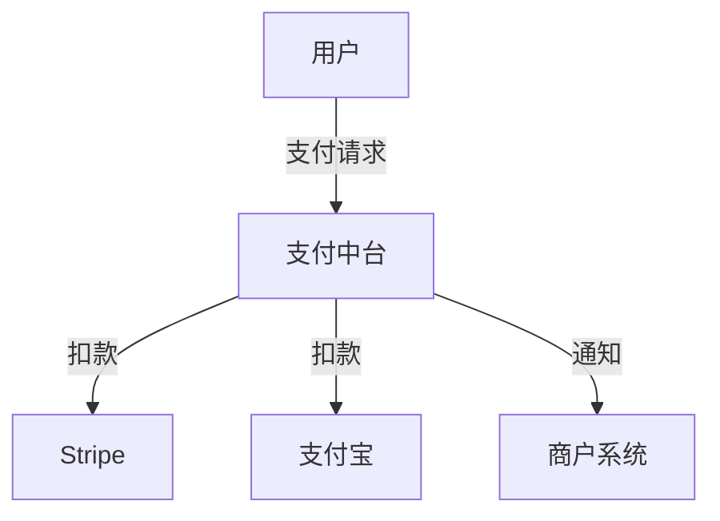
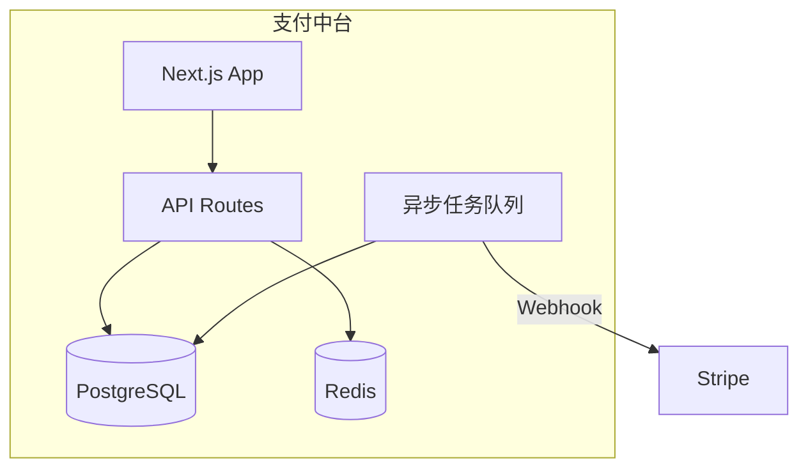

# 文件系统实现外部记忆系统

本文档详细介绍如何使用文件系统构建一个完整的外部记忆系统，帮助 AI 在复杂项目中保持稳定的上下文理解。

## 文档体系全景图

```
project-root/
|
|-- .ai/                          # AI 专属配置（隐藏目录，避免污染）
|   |-- .cursorrules              # Cursor 根规则（精简版）
|   |-- .cursor/
|   |   |-- rules/                # Cursor 分层规则（.mdc）
|   |   |   |-- 000-global.mdc       # 全局铁律（000 前缀确保优先）
|   |   |   |-- 100-architecture.mdc # 架构约束
|   |   |   |-- 200-frontend.mdc     # 前端规范
|   |   |   |-- 300-backend.mdc      # 后端规范
|   |   |   |-- 400-database.mdc     # 数据库规范
|   |   |   |-- 900-session.mdc      # 会话管理模板
|   |-- .clinerules               # Cline 规则（如使用）
|
|-- docs/                         # 人类可读文档（核心）
|   |-- 00-meta/                  # 元信息（项目本身）
|   |   |-- project-brief.md      # 项目一句话描述
|   |   |-- glossary.md           # 术语表（防歧义）
|   |   |-- changelog.md          # 项目级变更日志
|   |
|   |-- 10-requirements/          # 需求层（为什么做）
|   |   |-- prd.md                # 产品需求文档（Product Requirements）
|   |   |-- user-stories.md       # 用户故事（验收标准）
|   |   |-- archive/              # 已完成需求归档
|   |
|   |-- 20-architecture/            # 架构层（怎么做-设计）
|   |   |-- overview.md           # 架构全景图（C4 Model）
|   |   |-- tech-stack.md         # 技术栈及选型理由
|   |   |-- decisions/              # 架构决策记录（ADR）
|   |   |   |-- adr-001-auth-strategy.md
|   |   |   |-- adr-002-database-sharding.md
|   |   |   |-- adr-template.md   # 新建 ADR 的模板
|   |   |-- diagrams/               # 架构图（Mermaid 源码）
|   |   |   |-- system-context.mmd
|   |   |   |-- container.mmd
|   |   |-- constraints/            # 约束条件
|   |   |   |-- performance-sla.md  # 性能指标（P95<200ms）
|   |   |   |-- security-policy.md # 安全策略
|   |
|   |-- 30-tasks/                   # 任务层（当前做什么）
|   |   |-- task-index.md         # 任务总览（看板）
|   |   |-- T001-feature-name.md  # 具体任务（详见下方模板）
|   |   |-- T002-feature-name.md
|   |   |-- archive/                # 已完成任务归档
|   |
|   |-- 40-context/                 # 上下文层（AI 记忆）
|   |   |-- active-context.md     # 当前活跃上下文（AI 必读）
|   |   |-- progress.md           # 项目进度总览
|   |   |-- system-patterns.md    # 代码模式（复制粘贴用）
|   |   |-- sessions/               # 会话记录（按日期）
|   |   |   |-- 2026-04-19-001.md
|   |   |   |-- 2026-04-19-002.md
|   |
|   |-- 50-knowledge/               # 知识层（外部信息）
|   |   |-- api-docs/               # 第三方 API 文档（精简版）
|   |   |-- libraries/              # 库的使用笔记
|   |   |-- troubleshooting/          # 问题排查记录
|   |
|   |-- 90-templates/               # 模板层（快速创建）
|   |   |-- new-task.md           # 新建任务模板
|   |   |-- new-adr.md            # 新建 ADR 模板
|   |   |-- session-start.md      # 会话启动模板
|   |   |-- session-end.md        # 会话结束模板
|
|-- src/                          # 源代码（与 docs 镜像）
    |-- __docs__/                   # 代码内联文档（组件级）
        |-- Button.usage.md       # 组件使用示例
```

## 每类文档的详细规范

### 1. 项目元信息（docs/00-meta/）

#### project-brief.md - 项目一句话描述

```markdown
# Project Brief - 支付中台系统

## 电梯演讲（30秒版本）
为电商业务提供统一支付接入，支持多渠道（微信/支付宝/银联）的收款、退款、对账。

## 核心指标
- 日交易量：100万笔
- 可用性：99.99%
- P95 响应时间：< 200ms

## 关键约束
- 必须支持幂等性（防重复支付）
- 必须符合 PCI-DSS 安全标准
- 必须支持多币种（CNY/USD/EUR）

## 技术标签
`Next.js` `PostgreSQL` `Redis` `Stripe` `Docker` `K8s`

## 相关链接
- 线上环境：https://pay.company.com
- 监控大盘：https://grafana.company.com/d/pay
- 故障预案：docs/90-runbooks/
```

**用途**：新成员/新会话第一眼了解项目全貌。

#### glossary.md - 术语表（防歧义神器）

```markdown
# 术语表（Glossary）

| 术语 | 英文 | 定义 | 禁止的替代说法 |
|------|------|------|-------------|
| 支付单 | Payment Order | 用户发起的一次支付请求，包含金额、渠道、商品信息 | 订单（易与商品订单混淆） |
| 渠道 | Channel | 第三方支付提供商，如微信支付、支付宝 | 平台、网关 |
| 对账 | Reconciliation | 将平台交易记录与渠道结算单比对 | 结算（结算=对账+打款） |
| 幂等键 | Idempotency Key | 客户端生成的唯一标识，用于防重复提交 | UUID（太泛） |
| 冻结 | Hold | 资金暂不可用，但未实际扣除 | 锁定（易与并发锁混淆） |

## 缩写规范
- DO NOT USE: `PO`（歧义：Product Owner / Payment Order / Purchase Order）
- USE: `PayOrd`（代码内）、`支付单`（文档内）
```

**用途**：防止 AI 和你对同一个词理解不同。比如你说"订单"，AI 可能理解为电商订单，但你的意思是支付单。

### 2. 需求层（docs/10-requirements/）

#### prd.md - 产品需求文档

```markdown
# PRD: 支付中台 v2.0

## 背景
- Q2 完成 Stripe 接入（CNY/USD）
- Q3 完成 PayPal 接入（EUR/USD）
- 支付成功率从 95% 提升到 99.5%

## 目标
- Stripe 信用卡支付（3D Secure）
- 自动货币转换（基于 IP 或用户选择）
- 退款流程（原路返回）

## P0（必须）
- Stripe 订阅/自动扣款
- 支付失败自动重试（指数退避）

## P1（应该）
- 分期付款（Stripe Installments）

## P2（可以）
- [可选功能]

## 功能清单
- 合规：符合 Stripe 的 PCI 要求，不存储 CVV
- 性能：支付接口 P99 < 500ms
- 安全：所有 Webhook 必须验证签名

## 验收标准

### Feature: Stripe 信用卡支付
- Scenario: 成功支付
  - Given 用户填写了有效的信用卡信息
  - When 用户点击"确认支付"
  - Then 订单状态变为"已支付"
  - And 用户收到邮件通知
  - And Stripe 后台显示交易成功

- Scenario: 3D Secure 验证
  - Given 用户信用卡需要 3DS 验证
  - When 用户点击"确认支付"
  - Then 弹出 3DS 验证窗口
  - And 验证通过后完成扣款
```

#### user-stories.md - 用户故事（带验收标准）

```markdown
# 用户故事

## US-001: 作为用户，我想用信用卡支付
**优先级**：P0 | **故事点**：5 | **迭代**：Sprint 3

### 验收标准（AC）
- [ ] AC1: 支持 Visa/Mastercard/Amex
- [ ] AC2: 卡号输入时自动格式化（每4位空格）
- [ ] AC3: 实时验证卡号有效性（Luhn 算法）
- [ ] AC4: 错误时显示中文提示（非 Stripe 英文原样返回）

### 技术任务（拆分为 Task）
- [ ] T011: 前端卡号输入组件
- [ ] T012: Stripe Elements 集成
- [ ] T013: 3DS 回调处理
- [ ] T014: 支付结果轮询

### 关联
- 依赖：US-005（用户登录）
- 阻塞：US-020（订单创建）
```

### 3. 架构层（docs/20-architecture/）

#### overview.md - 架构全景图

```markdown
# 架构概览

## C4 Model

### L1: 系统上下文


### L2: 容器图


## 数据流
- 用户 -> Web -> API: 创建支付单
- API -> Stripe: 创建 PaymentIntent
- Stripe -> Worker: Webhook 通知
- Worker -> DB: 更新订单状态
- Worker -> Merchant: 回调通知

## 关键边界
- Web 层：无状态，可横向扩展
- Worker 层：至少 2 实例，防单点故障
- 数据库：主从复制，读写分离
```

#### tech-stack.md - 技术栈及选型理由

```markdown
# 技术栈

## 前端
| 技术 | 版本 | 选型理由 | 替代方案及拒绝原因 |
|------|------|---------|------------------|
| Next.js | 14 | App Router + Server Components 减少 API 往返 | Remix（生态较小） |
| Tailwind | 3.4 | 原子化 CSS，减少样式冲突 | CSS Modules（全局样式难管理） |
| shadcn/ui | 2024 | 可复制组件，无运行时依赖 | Ant Design（太重） |

## 后端
| 技术 | 版本 | 选型理由 | 替代方案及拒绝原因 |
|------|------|---------|------------------|
| Next.js API Routes | 14 | 前后端同构，减少部署复杂度 | Express（需单独部署） |
| Prisma | 5 | 类型安全 ORM，迁移方便 | Drizzle（当时生态不成熟） |
| tRPC | 11 | 端到端类型安全 | REST + Zod（重复定义 Schema） |

## 基础设施
| 技术 | 用途 | 备注 |
|------|------|------|
| PostgreSQL | 主数据库 | 15 版本，启用逻辑复制 |
| Redis | 缓存 + 队列 | 7 版本，持久化开启 |
| Stripe | 海外支付 | 测试模式密钥隔离 |

## 禁忌技术（禁止使用）
- [X] MongoDB：事务支持弱，不适合金融场景
- [X] Serverless Functions（Vercel Hobby）：冷启动影响支付体验
- [X] 本地文件存储：必须使用 S3/OSS
```

#### ADR 模板（decisions/adr-XXX-title.md）

```markdown
# ADR-003: 使用 Redis 存储支付会话

## 状态
已接受（Accepted）| 日期：2026-04-01 | 作者：@zhr

## 背景
支付流程涉及多步交互（创建意图->3DS验证->确认支付），需要跨请求保持状态。

## 决策
使用 Redis Hash 存储支付会话，TTL 设为 30 分钟。

## 考虑过的选项

| 选项 | 优点 | 缺点 | 结论 |
|------|------|------|------|
| PostgreSQL | 持久化，不丢数据 | 读写慢，需清理过期数据 | [X] 拒绝 |
| JWT Cookie | 无服务端状态 | 无法主动失效，不安全 | [X] 拒绝 |
| Redis | 快，支持 TTL | 需额外运维 | [O] 接受 |

## 后果
- 正面：支付接口延迟降低 50ms
- 负面：Redis 宕机时新支付无法创建（已购会话不受影响）
- 风险缓解：Redis 主从 + 持久化，RTO < 5 分钟

## 相关
- 影响：T001 用户认证（需共享 Redis 连接池）
- 被影响：ADR-005 熔断策略（Redis 超时降级到数据库）
```

### 4. 任务层（docs/30-tasks/）

#### task-index.md - 任务总览（看板）

```markdown
# 任务看板

## 进行中（WIP）
| ID | 任务 | 优先级 | 负责人 | 阻塞 | 预计完成 |
|----|------|--------|--------|------|---------|
| T001 | Stripe 接入 | P0 | AI+我 | T005 完成 | 2026-04-25 |
| T005 | 用户认证重构 | P0 | 我 | 等待设计稿 | 2026-04-22 |

## 待开始（Backlog）
| ID | 任务 | 优先级 | 依赖 |
|----|------|--------|------|
| T002 | PayPal 接入 | P1 | T001 完成 |
| T003 | 对账系统 | P1 | T001 完成 |

## 已完成（Done）
| ID | 任务 | 完成日期 | 备注 |
|----|------|---------|------|
| T000 | 项目初始化 | 2026-04-01 | 基础架构搭建 |

## 归档规则
- 完成的任务 7 天后移动到 `archive/`
- 保留 `task-index.md` 中的记录，但删除详细内容
```

#### 具体任务文档（T001-stripe-integration.md）

```markdown
# T001: Stripe 信用卡支付接入

## 元信息
- 状态：进行中 | 优先级：P0 | 故事点：13
- 负责人：Claude（编码）+ @zhr（验收）
- 迭代：Sprint 3（2026-04-15 ~ 2026-04-28）
- 关联：US-001, ADR-003

## 目标
实现 Stripe 信用卡支付，支持 3D Secure，成功率 > 95%。

## 已完成 [DONE]
- [x] 调研 Stripe PaymentIntent API
- [x] 配置 Stripe 测试环境
- [x] 实现 `/api/payment/create` 接口
- [x] 前端卡号输入组件（Luhn 验证）

## 进行中 [IN PROGRESS]
- [ ] 3DS 回调处理（预计 2 天）
- [ ] 支付结果轮询（预计 1 天）

## 待开始 [TODO]
- [ ] Webhook 签名验证
- [ ] 退款接口
- [ ] 错误码映射（Stripe 英文 -> 中文）

## 代码地图（Code Map）
/src/
|-- app/
|   |-- api/
|   |   |-- payment/
|   |   |   |-- route.ts          # POST 创建支付
|   |   |   |-- [id]/
|   |   |   |   |-- confirm/
|   |   |   |   |   |-- route.ts  # POST 确认支付（3DS 后）
|   |-- (payment)/
|   |   |-- checkout/
|   |   |   |-- page.tsx          # 支付页面
|-- components/
|   |-- payment/
|   |   |-- CardForm.tsx          # 卡号输入
|   |   |-- ThreeDSModal.tsx      # 3DS 弹窗
|   |   |-- PaymentStatus.tsx     # 状态显示
|-- lib/
|   |-- stripe/
|   |   |-- client.ts             # Stripe SDK 初始化
|   |   |-- payment-intent.ts     # PaymentIntent 操作
|   |   |-- webhooks.ts           # Webhook 处理
|   |-- payment/
|   |   |-- session.ts            # Redis 会话管理
|   |   |-- validator.ts          # 输入校验
|-- types/
    |-- payment.ts                # 支付相关类型

## 关键决策（链接 ADR）
- [ADR-003] 使用 Redis 存储会话 -> 影响 `lib/payment/session.ts`
- [ADR-004] 错误码统一格式 -> 影响所有 API 返回

## 接口契约（API Contract）
```typescript
// POST /api/payment/create
interface CreatePaymentRequest {
  amount: number;        // 单位：分，如 1000 = 10元
  currency: 'CNY' | 'USD';
  description: string;    // 商品描述，显示在账单上
  metadata?: Record<string, string>;
}

interface CreatePaymentResponse {
  id: string;            // 支付单 ID（内部）
  clientSecret: string;  // Stripe PaymentIntent client_secret
  status: 'requires_action' | 'succeeded';
}
```

## 测试策略
- 单元测试：lib/stripe/*.test.ts（Mock Stripe SDK）
- 集成测试：__tests__/payment-flow.test.ts（使用 Stripe 测试卡号）
- E2E 测试：Playwright，测试完整支付流程

## 测试卡号
| 卡号 | 场景 | 预期结果 |
|------|------|---------|
| 4242 4242 4242 4242 | 成功支付 | 直接成功 |
| 4000 0025 0000 3155 | 需要 3DS | 弹出验证 |
| 4000 0000 0000 9995 | 余额不足 | 失败，提示"银行卡余额不足" |

## 风险与阻塞
| 风险 | 概率 | 影响 | 缓解措施 |
|------|------|------|---------|
| Stripe 国内访问不稳定 | 中 | 高 | 配置代理，降级到支付宝 |
| 3DS 回调被浏览器拦截 | 低 | 高 | 同时支持轮询作为后备 |

## 会话记录
| 日期 | 会话 | 完成内容 | 下一步 |
|------|------|----------|--------|
| 2026-04-19 | #1 | 搭建基础接口 | 实现 3DS 弹窗 |
| 2026-04-20 | #2 | - | - |

## 交接摘要（Last Session）
- 时间：2026-04-19 18:00
- 完成：
  - 创建 PaymentIntent 接口
  - 前端卡号输入组件（支持格式化）
- 阻塞：
  - 3DS 弹窗需要设计稿确认弹窗样式
- 下一步：
  - 实现 ThreeDSModal.tsx 组件（设计稿确认后）
  - 对接 Stripe 3DS 验证流程
  - 写 lib/stripe/payment-intent.test.ts
```

### 5. 上下文层（docs/40-context/）

#### active-context.md - AI 必读（每次会话加载）

```markdown
# Active Context - 当前活跃上下文

## [IMPORTANT] 会话启动强制指令
AI 在回答前必须：
1. 确认已读取本文档
2. 确认已读取关联的 Task 文档
3. 回复开头声明："已加载活跃上下文"

## 当前任务
**T001: Stripe 信用卡支付接入**（进行中）
- 下一步：实现 3DS 弹窗组件
- 阻塞：等待设计稿确认

## 最近变更（Last 3 Changes）
1. [2026-04-19] 创建 PaymentIntent 接口 (`/api/payment/route.ts`)
2. [2026-04-19] 添加卡号输入组件 (`/components/payment/CardForm.tsx`)
3. [2026-04-18] 配置 Stripe SDK (`/lib/stripe/client.ts`)

## 当前代码状态
- 分支：`feature/T001-stripe`
- 最后提交：`a1b2c3d` - feat: add payment create endpoint
- 未提交更改：无

## 必须遵守的规则（精简版）
1. 所有支付金额单位必须是**分**（不是元）
2. Stripe 错误码必须映射为中文
3. Webhook 必须验证签名（`stripe.webhooks.constructEvent`）
4. 禁止在客户端暴露 `STRIPE_SECRET_KEY`

## 当前环境
- Node.js: 20.11.0
- Next.js: 14.2.0
- Stripe SDK: 15.0.0
```

#### progress.md - 项目进度总览

```markdown
# 项目进度

## 总体进度：35%（MVP 阶段）

## 模块进度
| 模块 | 进度 | 状态 | 预计完成 |
|------|------|------|---------|
| 用户系统 | 100% | [完成] | - |
| 支付核心 | 60% | [进行中] | 2026-04-25 |
| 订单系统 | 20% | [待开始] | 2026-05-05 |
| 对账系统 | 0% | [待开始] | 2026-05-20 |

## 本周目标（Sprint 3）
- [x] 完成 Stripe 基础接入
- [ ] 完成 3DS 验证
- [ ] 支付成功率达到 95%（测试环境）

## 燃尽图（Burndown）
13 故事点 |######-----| 6/13 完成

## 风险升级
- [高] Stripe 国内访问延迟 > 500ms（需 CDN 加速）
- [中] 设计稿延迟 2 天（影响前端进度）
```

#### system-patterns.md - 代码模式（复制粘贴用）

```markdown
# System Patterns - 可复制代码模式

## 模式 1: API 路由标准结构
```typescript
// 所有 API 路由必须遵循此结构
import { NextRequest, NextResponse } from 'next/server';
import { z } from 'zod';
import { logger } from '@/lib/logger';
import { AppError } from '@/lib/errors';

const RequestSchema = z.object({
  // 定义请求体
});

export async function POST(request: NextRequest) {
  try {
    const body = await request.json();
    const data = RequestSchema.parse(body);

    // 业务逻辑

    return NextResponse.json({ success: true, data: result });
  } catch (error) {
    if (error instanceof AppError) {
      logger.warn('Business error', { error });
      return NextResponse.json(
        { success: false, error: error.message, code: error.code },
        { status: error.statusCode }
      );
    }
    logger.error('Unexpected error', { error });
    return NextResponse.json(
      { success: false, error: '服务器内部错误', code: 'INTERNAL_ERROR' },
      { status: 500 }
    );
  }
}
```

## 模式 2: Stripe 错误处理
```typescript
// Stripe 错误统一映射
import { StripeError } from '@/lib/errors';

const stripeErrorMap: Record<string, string> = {
  'card_declined': '银行卡被拒绝，请更换卡片',
  'insufficient_funds': '银行卡余额不足',
  'expired_card': '银行卡已过期',
  'incorrect_cvc': '安全码错误',
  'processing_error': '支付处理失败，请稍后重试',
};

export function mapStripeError(stripeError: Stripe.errors.StripeError): AppError {
  const message = stripeErrorMap[stripeError.code] || '支付失败，请稍后重试';
  return new AppError(message, 'PAYMENT_FAILED', 400);
}
```

## 模式 3: Redis 会话操作
```typescript
// 支付会话 CRUD
import { redis } from '@/lib/redis';

const SESSION_TTL = 30 * 60; // 30 分钟

export async function createSession(paymentId: string, data: SessionData) {
  await redis.hset(`payment:session:${paymentId}`, data);
  await redis.expire(`payment:session:${paymentId}`, SESSION_TTL);
  return paymentId;
}
```

## 模式 4: tRPC 路由定义
```typescript
// 所有 tRPC 路由必须包含 meta（权限）
export const paymentRouter = router({
  create: protectedProcedure
    .meta({ requiredPermission: 'payment:create' })
    .input(CreatePaymentSchema)
    .mutation(async ({ ctx, input }) => {
      // 实现
    }),
});
```

### 6. 会话层（docs/40-context/sessions/）

#### 会话启动模板（session-start.md）

```markdown
# Session Start Template

## 会话目标
[一句话说清楚这次要做什么]

## 前置上下文（必须读取）
- [ ] @/docs/40-context/active-context.md
- [ ] @/docs/30-tasks/T001-stripe-integration.md

## 代码状态
- 分支：`feature/T001-stripe`
- 最后提交：`a1b2c3d`
- 未提交更改：[如果有，描述]

## 本次约束
- 只修改 `components/payment/` 和 `lib/stripe/` 目录
- 不要修改 API 路由（上次已完成）
- 必须写测试（TDD）

## 验收标准
完成时，必须能：
1. 输入测试卡号 4242...4242，点击支付
2. 看到 3DS 弹窗模拟
3. 验证通过后显示"支付成功"
```

#### 会话结束模板（session-end.md）

```markdown
# Session End Template

## 会话总结

### 完成的工作
1. [具体完成项，带文件路径]
2. [具体完成项，带文件路径]

### 代码变更
| 文件 | 变更类型 | 说明 |
|------|---------|------|
| `components/payment/ThreeDSModal.tsx` | 新增 | 3DS 弹窗组件 |
| `lib/stripe/three-ds.ts` | 新增 | 3DS 验证逻辑 |

### 遇到的阻塞
- [ ] [阻塞描述] -> [解决方案或需要谁解决]

### 关键决策
- [决策描述] -> 已记录到 ADR-XXX / 待记录

### 下一步（精确到文件/函数）
1. [ ] 实现 `ThreeDSModal` 的关闭逻辑（`onClose` prop）
2. [ ] 写 `__tests__/three-ds.test.ts`
3. [ ] 对接真实 Stripe 3DS 测试卡

### 状态同步检查
- [ ] 已更新 `active-context.md`
- [ ] 已更新 `T001-stripe-integration.md` 进度
- [ ] 已更新本文件到 `sessions/2026-04-19-XXX.md`
```

### 7. 知识层（docs/50-knowledge/）

#### api-docs/stripe-simplified.md - 精简版第三方文档

```markdown
# Stripe API 精简笔记

## 核心概念
| 概念 | 说明 | 对应我们的代码 |
|------|------|-------------|
| PaymentIntent | 支付意图，代表一笔待完成的支付 | `lib/stripe/payment-intent.ts` |
| Client Secret | 前端完成支付所需的密钥 | 传给 `ThreeDSModal` |
| Webhook Endpoint | Stripe 通知我们支付结果 | `/api/webhooks/stripe` |

## 关键端点
```typescript
// 创建 PaymentIntent
const paymentIntent = await stripe.paymentIntents.create({
  amount: 1000,           // 单位：分
  currency: 'cny',
  automatic_payment_methods: { enabled: true },
  metadata: { orderId: '123' },
});

// 确认支付（3DS 后）
await stripe.paymentIntents.confirm(paymentIntent.id, {
  payment_method: 'pm_xxx',
});
```

## 测试卡号速查
| 卡号 | 场景 | 3DS |
|------|------|------|
| 4242 4242 4242 4242 | 成功 | 否 |
| 4000 0025 0000 3155 | 需要 3DS | 是 |
| 4000 0000 0000 9995 | 失败 | 否 |

## 坑与解决方案
| 坑 | 解决方案 |
|------|---------|
| Webhook 签名验证失败 | 确保使用 req.text() 而非 req.json() |
| 金额小数点错误 | 始终用整数分，不要浮点数 |
| 3DS 回调被拦截 | 同时支持轮询查询状态 |
```

### 8. 模板层（docs/90-templates/）

#### new-task.md - 新建任务模板

```markdown
# TXXX: [任务名称]

## 元信息
- 状态：待开始 | 优先级：[P0/P1/P2] | 故事点：[数字]
- 负责人：[名字]
- 迭代：[Sprint X]
- 关联：[US-XXX, ADR-XXX]

## 目标
[一句话目标]

## 验收标准
- [ ] [可验证的标准 1]
- [ ] [可验证的标准 2]

## 代码地图（待填充）
/src/
|-- [目录结构]

## 风险
| 风险 | 概率 | 影响 | 缓解 |

## 会话记录
| 日期 | 会话 | 完成 | 下一步 |
```

## 文档间的关联关系

```
project-brief.md
    |
    |---> prd.md ---> user-stories.md ---> T001.md ---> sessions/
    |                                              |
    |---> tech-stack.md ---> ADR-XXX ----------------+
           |
           |---> system-patterns.md ---> [代码文件]
```

## 读取顺序（AI 每次会话应该按此顺序加载）
1. project-brief.md（了解项目）
2. active-context.md（了解当前状态）
3. T001.md（了解具体任务）
4. system-patterns.md（了解如何写代码）

## 实战：一次完整的工作流

### 【周一早上 - 开始新功能】
1. 复制 new-task.md -> docs/30-tasks/T004-paypal-integration.md
2. 填充目标、验收标准、代码地图（空）
3. 更新 active-context.md：当前任务改为 T004
4. 开启 AI 会话：
   "请读取 docs/40-context/active-context.md 和
    docs/30-tasks/T004-paypal-integration.md，
    我们今天开始 PayPal 接入。"

### 【工作中 - 每 30 分钟】
5. 完成一个子任务 -> 更新 T004.md 进度
6. 遇到坑 -> 记录到 T004.md "风险"表格
7. 做决策 -> 创建 ADR，链接到 T004.md

### 【下班前 - 会话结束】
8. 填写 session-end.md
9. 复制到 docs/40-context/sessions/2026-04-21-001.md
10. 更新 active-context.md：进度、下一步、阻塞
11. 提交 Git：git add docs/ && git commit -m "docs: update T004 progress"

### 【周二早上 - 继续工作】
12. 读取 session-logs/2026-04-21-001.md
13. 开启新会话："请读取 active-context.md 和 T004.md，
    昨天我们完成了...，今天继续..."

## 关键原则

| 原则 | 说明 |
|------|------|
| 一个任务一个文件 | 不要所有任务写在一个文档里 |
| 代码地图必须精确到文件 | AI 需要知道去哪找代码 |
| 决策必须链接到 ADR | 防止 AI 重复问"为什么不用 X" |
| 会话记录必须包含"下一步" | 这是新会话的启动点 |
| 所有文档进 Git | 版本控制 + 团队协作 |

这套体系的维护成本大约是每天 10-15 分钟，但能让 AI 在复杂项目中保持稳定的上下文理解，避免"失忆"导致的重复劳动。

